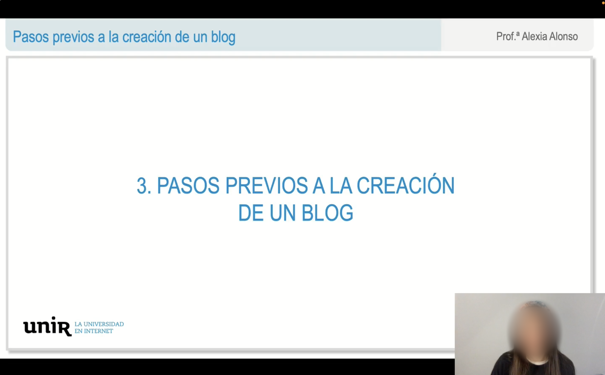

# remove-logo-from-video

Este proyecto permite eliminar logos o marcas de agua que aparecen en vídeos sin necesidad de realizar una edición manual y poder procesar varios vídeos simultáneamente.

## Características

- Compatibilidad con múltiples dispositivos (CPU, GPU).
- Estabilización de fps del vídeo.
- Detección de logo/s de diferentes tamaños.

## Instalación

Para ejecutar este proyecto, necesitas tener `Python` instalado junto con las siguientes dependencias:

```bash
pip install -r requirements.txt
```

Además, necesitas tener ffmpeg instalado en tu sistema. Consulta las instrucciones de instalación de ffmpeg para tu sistema operativo específico:

### Windows:

Descargar: (https://ffmpeg.org/download.html)

### macOS:

Usando Homebrew:

```bash
brew install ffmpeg
```

### Ubuntu/Debian:

```bash
sudo apt update
sudo apt install ffmpeg
```

## Uso

Para ejecutar el script, primero asegúrate de que tus videos estén en la carpeta "videos".

Para el ejemplo se muestran unas capturas de un vídeo que no se tiene licencia de publicación y que si nos fijamos durante todo el vídeo tiene en la esquina inferior izquierda un logo que se desea eliminar.



Una vez se tiene todo listo es necesario configurar si se quiere usar GPU, solo disponible para CUDA:

```python
USE_GPU = True # or False
```

y modificar el parámetro para localizar el icono a buscar y el número de hilos qu eindica el número de vídeos que se van a procesar simultáneamente:

```python
icon_path = './icon.png'
num_threads = 2
```

Una vez está todo listo, solo es necesario ejecutar el siguiente comando:

```python
python script.py
```

A continuación muestro el mismo frame que el de arriba pero una vez se ha terminado de procesar el vídeo completamente:

